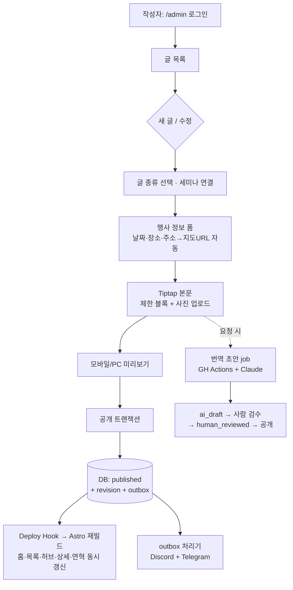

# 세미나 콘텐츠 플랫폼 — Claude 검토·계획 (Codex 안 교차 검증)

작성일: 2026-07-22
대상 브랜치: `fix/comprehensive-bug-fixes`
성격: `docs/plans/2026-07-22-seminar-content-platform-codex.md`(이하 Codex 안)에 대한 독립 리서치 기반 교차 검증 + 시안 A 제공. 병렬 리서치는 워크플로우 에이전트 7개(저장소 맵 3 + 웹 리서치 4)로 수행했다.

## 결론 요약

| 항목 | Codex 안 | 독립 검증 결과 | 판정 |
|---|---|---|---|
| 에디터 | Tiptap 3 | Tiptap v3 단독 1위 (아래 근거) | **일치 — 확정 권장** |
| URL | `/{lang}/seminars/{sequence}` + kind/postNo | 동일 결론 | **일치** |
| 지도 | 주소 입력 → URL 자동 생성 | 동일 결론 (API 키·비용 0) | **일치** |
| 번역 | 요청형 비동기 + Claude + 검수 게이트 | 동일 구조. 볼륨상 월 $0.5 미만 | **일치, 비용 근거 보강** |
| 알림 | outbox + 재시도 | 동일 구조 | **일치** |
| 권한 | RLS로 owner만 DELETE | DB 강제가 유일한 실질 강제 수단 | **일치** |
| 백엔드 | Supabase Free 1차 | **유일한 쟁점** — Git 기반 CMS(Pages CMS)가 유지보수·비용에서 우위라는 반론 존재 | 아래 §4 |

## 1. 제1차 세미나 링크 맵 (전수 조사)

`seminars.json`의 1차 레코드(s2025-laos / s2025-laos-en)가 실제로 노출·연결되는 지점 전체:

```text
렌더링 (5곳)
├─ 상세  /{ko,en}/seminars/2025-laos → (신규) /{ko,en}/seminars/1
│    └─ 이전에는 본문 필드가 없어 hasBody=false → "세부 주제와 프로그램은 추후 안내됩니다." 폴백만 출력
├─ 목록  /{ko,en}/seminars  "지난 세미나" 카드 → 상세로 직접 링크 (유일한 직접 링크)
├─ 홈    /{ko,en}/  past[0]="최신 세미나" 타일
│    └─ 주의: 버튼이 상세가 아니라 목록(/seminars)으로 이동 + 개최 세미나 수 stat "1"
├─ 연혁  /{ko,en}/about#history — history.json에 중복 레코드(seminar1-2025[-en]), 상세 링크 없음
└─ sitemap.xml — ko slug 기준 ko/en 상세 URL 2건

비렌더 참조 (운영·검증)
├─ scripts/verify.mjs, scripts/a11y.mjs — /ko/seminars/2025-laos 하드코딩 → sequence 경로로 갱신 필요
├─ public/_redirects — /seminars/* → /ko/seminars/:splat (+ 신규: 2025-laos → /1 별칭 301)
├─ docs/superpowers/specs/2026-07-19-l13 — Lighthouse 대상 경로 기록
└─ README.md — "제1회 세미나" 표기
```

구조적 문제 2건(Codex 안도 동일 지적):
- **이중 저장**: `seminars.json`과 `history.json`이 같은 행사를 별도 보유 → 수정 누락 위험. 단일 원천으로 파생 필요.
- **홈 버튼이 상세 미연결**: 최신 세미나 타일이 목록으로만 이동. 상세 허브로 직결 권장.

## 2. 시안 2종 (고객 컨셉 승인용)

| | 시안 A (Claude) | 시안 B (Codex) |
|---|---|---|
| 경로 | `/ko/seminars/1` (실 데이터 경로) | `/ko/seminars/1-preview` (전용 프리뷰) |
| 형식 | 현행 상세 템플릿 확장 — 행사개요 박스·주제·프로그램·연사·주요결과·현장사진 갤러리·자료. 전부 JSON 필드 기반 | 리포트/매거진형 — 히어로 사진, 사이드바 행사정보, 인용문, 타임라인(하루의 흐름), 번호형 성과. Tiptap 블록 모델과 1:1 대응 |
| 더미 표기 | 모든 텍스트에 "(예시)" 명기, SVG placeholder 4장 | 상단 "비공개 콘텐츠 시안" 배너, webp 연출 사진 |
| 함의 | 구조화 필드만으로 충분한 "기록형" 글 | 작성자가 서사를 쓰는 "리포트형" 글 |
| 스크린샷 | `.scratch/seminar-mockup/claude-draft-ko-{desktop,mobile}.png` | `.scratch/seminar-mockup/codex-preview-ko-{desktop,mobile}.png` |

두 시안은 배타적이지 않다. 최종 콘텐츠 모델(구조화 필드 + body 블록)은 두 형식을 모두 표현한다. 고객에게는 "정보 밀도(A) vs 서사·사진 비중(B)" 선호를 묻는 용도로 쓴다.

시안 A를 위해 추가된 코드(본 세션): `content.config.ts`에 `photos[]` 스키마, `seminar-detail.astro`에 주요결과·현장사진 섹션, i18n 라벨 2쌍(`outcomesLabel`, `galleryLabel`), placeholder SVG 4장. 이 갤러리·성과 렌더 패턴은 최종 렌더러의 `gallery`/`outcomes` 블록 출력으로 그대로 승계 가능.

## 3. 에디터 — Tiptap v3 확정 (독립 검증)

결정 기준 1순위는 **한글 IME 조합 정확성**. 이 기준이 후보군을 ProseMirror 계열로 좁힌다 — prosemirror-view(1.42.1, 2026-07 패치 지속)가 contenteditable 세계에서 유일하게 10년간 CJK 조합 버그를 다져온 레이어다.

| 후보 | 2026 유지보수 | 한글 IME | 판정 |
|---|---|---|---|
| **Tiptap v3** | 3.28.0 (2026-07-15), 주단위 릴리스 | ProseMirror 계승, 강함. WebKit 헤딩 CJK 중복 엣지(#7271) 출시 전 실기기 테스트 필요 | **채택** |
| Milkdown Crepe | 7.21.3 (2026-07-12), 사실상 1인 | ProseMirror 계승, 양호 | 러너업 (버스팩터) |
| SunEditor v3 | 3.2.2 (2026-07-13), 한국인 1인 | 자체 엔진, 한글은 양호 추정 | 3위 — HTML-only 출력, 253kB gz |
| **tui.editor (사용자 제안)** | **사망 — 최종 릴리스 3.2.2 (2023-02-17), 미해결 이슈 574** | 살아있을 땐 좋았음 | **탈락 — 2026년 채택 불가** |
| Lexical | 매우 활발 (Meta) | **약함** — 한글 조합 버그 반복(#5841, #7985, #8098 open) | 탈락 |
| Quill v2 | 휴면 (2024-11 이후) | iOS 한글 #3827, 세벌식 #4449 open | 탈락 |
| Editor.js | 둔화 | 블록별 naive contenteditable, 모바일 약함 | 탈락 |
| CKEditor 5 | 매우 활발 | 좋음 | 탈락 — GPL/상용 이중 라이선스 |

Tiptap 추가 근거: 2025-06에 FileHandler 등 구 Pro 확장 10종 MIT 전환, 3.7.0부터 공식 양방향 Markdown, `@tiptap/static-renderer`로 저장 JSON → 서버측 HTML 변환(Astro 빌드에 이상적), React island로 사용 가능(현 구현과 일치). 비용: 번들 ~100kB gz — `/admin` 전용 로드라 공개 사이트 무영향.

Codex 안의 제한 블록 정책(문단·제목·인용·목록·이미지·custom node 4종만 허용, 임의 색상·HTML·iframe 금지)에 동의. **50대+ 비개발자에게는 자유도가 아니라 실패 불가능성이 UX다.**

## 4. 백엔드 — 유일한 쟁점

현 구현(src/lib/admin, supabase/)은 Supabase 경로로 진행 중. 독립 리서치는 다른 순위를 냈다:

| | ① Supabase Free (현 구현) | ② Git-CMS: Pages CMS | ③ Cloudflare D1+R2+Access |
|---|---|---|---|
| 계정 모델 | **owner가 직접 발급하는 id/pw — 요구사항 문자 그대로** | 이메일 매직링크 (비번 없음, GitHub 계정 불요) | Access 이메일 OTP(50인 무료) 또는 자체 구현 |
| 삭제 권한 강제 | **Postgres RLS — 기술적 강제** | 설정(`delete: false`)+관습 — 우회 가능 | Functions에서 직접 구현 |
| 콘텐츠 위치 | Supabase DB (git 이탈) | **git에 JSON/MD로 잔존** — 이력·백업 공짜 | D1 (git 이탈, commit-back 가능) |
| 구현량 | 40–80h+ (상당 부분 완료) | **1–2일** | 30–60h |
| 유지보수 | 커스텀 admin 앱 평생 소유 | 사실상 0 (에디터는 교체 가능한 UI) | 커스텀 소유 |
| 월 비용 | $0 (Free) | $0 | $0 |
| 최대 리스크 | **1주 비활성 시 프로젝트 일시정지**, 500MB DB/1GB Storage | 호스티드 서비스 지속성(MIT 셀프호스트 가능), i18n 필드 약함, **Tiptap 커스텀 블록 UX 불가** | 인증·보안 코드 직접 소유 |

판단:
- 요구사항 중 **기술적으로 강제되어야 하는 것**(owner만 삭제, id/pw 발급, 커스텀 블록 에디터, 번역 상태 머신)은 ②로 충족 불가. ②는 "마크다운 글쓰기 + 사진"이 전부일 때의 답이다.
- 현 구현이 이미 상당히 진행됐고(테스트 108개 통과), 시안 B 수준의 리포트형 콘텐츠·번역 워크플로우·outbox를 목표로 하는 이상 **① 지속이 합리적**.
- 단, Supabase Free의 **자동 일시정지**는 실운영 결격 사유가 될 수 있다. 대응: (a) 주간 keep-alive ping(GitHub Actions cron 1줄), (b) 고객 승인 후 Pro($25/mo) 전환 여부를 운영비 결정으로 명시, (c) 장기 $0가 절대 조건이면 ③으로 이식(스키마·권한 로직 재사용 가능하게 repository 계층 분리 유지 — 현 구현의 `repository.ts` 구조가 이 목적에 부합).
- 참고 사실(2026-07 검증): Cloudflare Pages는 Workers 정적 자산으로 흡수 중(강제 기한 없음), Deploy Hook은 Pages·Workers Builds 양쪽 지원, D1 free 5GB/일 5M read, R2 free 10GB+egress 0.

## 5. URL·라우팅 (구현 반영 확인)

```text
/{lang}/seminars                          목록
/{lang}/seminars/{sequence}               회차 허브   ← canonical (예: /ko/seminars/1)
/{lang}/seminars/{sequence}/{kind}/{postNo}-{slug}   글 상세
/{lang}/seminars/2025-laos                → 301 → /{lang}/seminars/1  (영구 별칭)
```

- 구현 확인: `[sequence].astro`, `[sequence]/[kind]/[post].astro`, `[...alias].astro`, `_redirects` 별칭 4줄 존재. 사용자가 요구한 "연도-지역 대신 1·2·3차 구분" 충족.
- sequence·postNo가 영구 식별자, 제목 변경 시 slug만 갱신 + 구 URL 301 별칭. kind 변경도 동일 정책.
- 남은 작업: `scripts/verify.mjs`·`a11y.mjs`의 2025-laos 하드코딩 → `/ko/seminars/1` 갱신, sitemap sequence 기반 재생성 확인.

## 6. 작성 UX 입력 규칙 (사용자 질문에 대한 답)

```text
질문: "미래/과거 세미나를 라디오·체크박스로 받을까?"
답:   받지 않는다. starts_at + 현재시각으로 계산. 예외 상태만 select (예정/완료/연기/취소).

질문: "글 종류 선택은?"
답:   단일 선택 — 큰 카드형 라디오 (안내/초대장/결과보고/활동기록/자료/소식).
      체크박스 금지(중복 분류 방지). 복수 선택은 태그(참여국·주제)에만 허용.

질문: "구글 지도 링크는 사용자가 직접?"
답:   아니오. 장소명+주소만 입력받고 시스템이 생성:
      https://www.google.com/maps/search/?api=1&query=${encodeURIComponent(address)}
      저장 전 생성된 링크 미리보기로 확인시킴. API 키·비용 0.

질문: "로그인은 어디에?"
답:   /admin 직접 주소 + 푸터 소형 링크만. 주 내비게이션 오염 금지.
      비인증 /admin 접근 → 로그인 리다이렉트.
```

글 공개 시 파생 노출(단일 원천 → 다중 표면):

```text
published post
  ├─ kind=announcement/invitation → 예정 세미나 허브 "관련 안내" + 홈 차기 세미나
  ├─ kind=report/activity         → 지난 세미나 허브 + 홈 "최근 활동" + about 연혁(파생)
  └─ kind=materials               → 허브 "관련 자료"
seminar.starts_at
  ├─ 미래 → 홈 차기 세미나 타일
  └─ 과거 → 아카이브 목록 (홈 타일은 상세 허브로 직결하도록 수정)
```

## 7. 번역 — 비용 실측 기반 확정

2–10건/월 × ~2,000자 기준 (2026-07 요금 검증):

| 옵션 | 월 비용 | 비고 |
|---|---|---|
| Claude Haiku 4.5 API | **$0.02–0.10** | markdown·용어집·격식 보존 유일. vi 강함, lo 가능(검수 필수) |
| DeepL API Free | $0 (50만자/월) | ko 품질 중간, markdown 미보존, **lo 미지원** |
| Google Translation | $0 (50만자/월) | 유일하게 vi+lo 모두 지원하는 고전 MT |
| Papago (NCP) | $0 (15만자/월) | ko 품질 최고(고전 MT 중), lo 미지원 |
| 수동 복붙 | $0 + 월 10–50분 | 품질 동급. 리스크는 규율(누락·용어 표류) |

결론: **비용은 논점이 아니다** — 전 옵션이 사실상 $0. Codex 안의 요청형 비동기(버튼 → GitHub Actions → Claude → `ai_draft` → 사람 검수 → 공개)가 맞는 구조이고, 자동화의 정당성은 비용 절감이 아니라 **"번역 누락·용어 표류·미검수 공개" 실패 모드 제거**다. 기계 초안 자동 공개 금지(학술 단체 신뢰 비용) 동의. 용어집 파일 1개를 API 프롬프트·수동 프롬프트가 공유. 원문 revision 변경 시 stale 처리 동의.

## 8. 알림 — 트리거 지점 확정

- **DB 공개 플로우(현 구현)**: 공개 트랜잭션에서 `notification_outbox` 행 생성 → 별도 처리기가 Discord webhook·Telegram sendMessage 전송. `event_id+channel` unique로 중복 차단, 429 `retry_after` 존중, 2–3회 재시도 후 드롭(알림은 결제가 아님). — Codex 설계·`scripts/notifications/` 구현과 일치.
- 세부: Discord embed 제목 256자 제한, 웹훅 URL 자체가 시크릿. Telegram은 MarkdownV2 대신 HTML parse_mode(이스케이프 3자만). 시크릿은 GH Secrets/wrangler secret — 코드·DB에 두지 않음.
- 신규/수정 구분 메시지("새 글 등록" vs "글 수정") + 수정 스팸은 `last_notified_at` 디바운스.

## 9. 권한 매트릭스

| 행위 | author (N명, owner 발급) | owner (1명) |
|---|---|---|
| 글 등록·수정(타인 글 포함) | ✓ | ✓ |
| 즉시 공개 / kind 변경 | ✓ | ✓ |
| 이미지·자료 업로드 | ✓ | ✓ |
| 번역 초안 요청·검수 | ✓ | ✓ |
| **삭제** | ✗ (RLS 거부, UI 숨김은 불충분) | ✓ (30일 soft-delete 기본) |
| 계정 발급·역할 변경 | ✗ | ✓ |

## 10. 전체 플로우 다이어그램



## 11. 검증 현황 (2026-07-22 07:00Z 기준, 최신 실행)

- `npm run build`: 통과 (21페이지) — 단, 병렬 작업으로 트리가 유동적, 머지 전 재실행 필수
- `npm test`: **108 통과 / 2 실패** — 실패는 `supabase/tests/schema-contract.test.mjs` (마이그레이션에 `create_post_draft` 함수·`stale_revision` 미구현: Codex 레인의 TDD RED 상태로 판단, 본 검토에서 미수정)
- `astro check`: 기존 노이즈 2건(coverage 산출물, vitest 타입)만 — 신규 오류 없음
- 시각 검증: ko 데스크톱/모바일 스크린샷 4장 `.scratch/seminar-mockup/` (시안 A 갤러리 3·4번은 lazy-load 타이밍으로 스크린샷에만 미표시, 실페이지 정상)

## 12. 결정 필요 (고객/오너)

1. **시안 방향**: A(기록형) vs B(리포트형) vs 절충 — 콘텐츠 모델은 양쪽 다 수용하므로 "기본 템플릿" 선택 문제
2. **백엔드 확정**: Supabase 지속(현 구현, keep-alive 운용) vs Cloudflare 이식(장기 $0 절대 조건일 때). §4 결정 규칙 참조
3. **원문 언어 기본값**: Codex 안은 en 기본 — 실제 작성자 다수가 한국어라면 ko 기본으로 뒤집을지
4. **운영비 상한**: 고객 승인 후 실서비스에서 Supabase Pro($25/mo) 허용 여부
